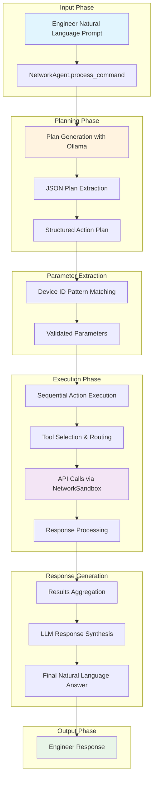

# Challenge Report
## Preparation
#### 1. Read the challenge carefully to match and achieve my mission goals
   1. Understand the scenario.
   2. Visit sandbox link and explore it.
   3. Comprehend the expectation from the evaluation team.
   4. Underline the deliverables to pass the challenge.
   5. Considering time expectation to respect it.

#### 2. Planning
   1. Deep Dive through the 5G network environment sandbox.
   2. Code NetworkSandbox class in `engine.py` and `test_api.py` to communicate with network endpoints, and verify if it is working well.
   3. Build NetworkAgent in `agent.py` upon the NetworkSandbox class to use endpoints methods as Tools.
   4. Program `test_agent.py` file to test different scenarios.

## Step-by-step walkthrough
### 1. NetworkSandbox class:
I decided to create an engine that would handle different API request through a 
class 
that would be modulable and flexible. 
```
class NetworkSandbox:
    def __init__(self, base_url: str = "http://localhost:8080/api/v1"):
        self.base_url = base_url
        self.session = requests.Session()
        # Common headers for API requests
        self.session.headers.update({
            'Content-Type': 'application/json',
            'Accept': 'application/json'
        })
```
#### Core Request Handler
The heart of the `NetworkSandbox class` is the `_make_request` method, 
which provides a unified way to handle all API interactions:
#### API Endpoint Implementations
Based on the OpenAPI specification, I implemented the six required endpoints:
1. Network Control Operations:`start_network` and `stop_network`
2. Device Management Operations: `connect_device` and `disconnect_device`
3. Monitoring Operations: `get_network_status` and `get_system_logs`
4. Utility Methods: `is_network_running`  and `wait_for_operation`

#### Robust Error Handling and Retry Mechanism 
A critical component I implemented was the `_retry_operation` method to ensure reliability in network operations

### 2. API Testing and Validation
Before building the intelligent agent, I created comprehensive testing utilities in `test_api.py`:
```
import json
from engine import NetworkSandbox

def test_sandbox():
    ...
    # Test starting the network with retry
    print("\n1. Starting network (with retry)...")
    result = sandbox.start_network(max_retries=5, retry_delay=2.0)
    print(f"Final result: {json.dumps(result, indent=2)}")

    ...
```

### 3. Intelligent Agent Architecture
#### NetworkAgent Class Design
The core intelligent agent builds upon the NetworkSandbox foundation:
```
class NetworkAgent:
    def __init__(self, model_name: str = "deepseek-r1:7b"):
        """Initialize the intelligent network agent with Ollama integration"""
        self.sandbox = NetworkSandbox()
        self.model_name = model_name
        self._initialize_tools()
        self._check_model_availability()
    ...
```
1. **Tool System Implementation:** The agent uses a dynamic tool system that maps natural language commands to API operations via `_initialize_tools`
2. **Intelligent Planning Engine:** The key innovation is the planning system that uses LLM reasoning to generate a plan `_generate_plan`
3. **Natural Language Processing:** Advanced NLP capabilities for parameter extraction in `_extract_device_id`
4. **Execution Pipeline:** The agent follows a sophisticated four-step execution process in `process_command`

### 4. Testing Framework Implementation
#### Comprehensive Scenario Testing
`test_agent.py` provides a robust testing environment:
```
def test_agent_scenarios():
    """Test the agent across multiple real-world scenarios"""
    test_scenarios = [
        {
            "name": "Basic Network Check",
            "command": "Something seems wrong with the network, can you check it out?",
            "description": "General troubleshooting"
        },
```
#### Interactive Mode
For real-time testing and demonstration:
```
def interactive_mode(self):
    """Start an interactive session with the agent"""
    print("🤖 Intelligent Network Agent - Interactive Mode")
    
    while True:
    ...
```

## End-to-End Pipeline


